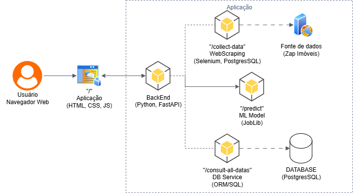

Projeto da fase 3 da pós-graduação em machine Learning Engeneering, criação de arquitetura AWS para uma aplicação baseada em machine learning de previsão de preços de imóveis.
# 📘 FIAP Tech Challenge Machine Learning Property - Fase 3

Aplicação baseada em Machine Learning, treinei um modelo de predição de valores de imóveis reais do Brasil.
Raspagem dos dados foi feita do site [Zap Imóveis](https://www.zapimoveis.com.br/) e armazenados no banco de dados PostgresSQL.
Aplicação foi levantada com [FastAPI](https://fastapi.tiangolo.com/).
---

## 📌 Sobre o Projeto

Este repositório corresponde à entrega final da terceira fase do curso de pós-graduação em Engenharia de Machine Learning. Ele tem como objetivo apresentar um modelo de machine learning treinado e utilizado em produção, aplicando todos os conceitos e habilidades desenvolvidas e aprendidas durante a fase.

## ⚙️ Tecnologias Utilizadas

| Tecnologia     | Função                                        |
| -------------- | --------------------------------------------- |
| FastAPI        | Framework de alta perfomance para cosntrução de APIs              |
| PostgresSQL    | Banco de dados relacional de alta perfomance                   |
| Scikit-Learn   | Framework de construção de modelos de machine learning             |
| Poetry         | Gerenciamento de dependências e ambiente      |
| Selenium       | Automação de navegadores web para testes e extração de dados.      |
| Joblib         | Biblioteca para paralelizar e otimizar a execução de funções em Python.      |
| MatplotLib     | Criação de visualizações estáticas, animadas e interativas em Python.      |
| Seaborn        | Geração de gráficos estatísticos atraentes e informativos com base no Matplotlib.      |
| Jupiter        | Ambiente interativo para escrever e executar código, visualizar dados e documentar projetos.      |
| XGBoost        | Biblioteca de Gradient Boosting otimizada para performance, velocidade e precisão.      |
| Lightgbm       | Framework de Gradient Boosting focado em alta velocidade e baixo uso de memória.      |

---

## 📐 Arquitetura



---

## 🚀 Como Executar Localmente

### 📦 Requisitos

* [Python 3.13+](https://www.python.org/downloads/)
* [Poetry](https://python-poetry.org/docs/)

### 📂 Instalação via Poetry e inicialização da infra via Terraform

```bash
git clone https://github.com/camilapiva/embrapa-api.git
poetry install
uvicorn src.app_propieters_ml.api.main:app --reload
```
---
## 📌 Boas Práticas Aplicadas

* API com segurança de API-KEY
* Pré-tratamento dos dados
* Análise exploratória do dados
* Engenharia de features
* Inputação de dados faltantes
* Pipeline de pré-processamento
* One-Hot Encoder para features categóricas
* Validação de dados com Pydantic
* Treinamento de diferentes modelos para a obter o melhor
* Utilização de API segura para a consulta dos dados para o treinamento do modelo
* Uso de `.env` para segredos e configurações
---

## 👥 Contribuição

Pull requests são bem-vindos! Abra uma issue ou contribua diretamente via fork + PR.

---

## 📃 Licença

Este projeto está licenciado sob os termos da licença [MIT](LICENSE).
